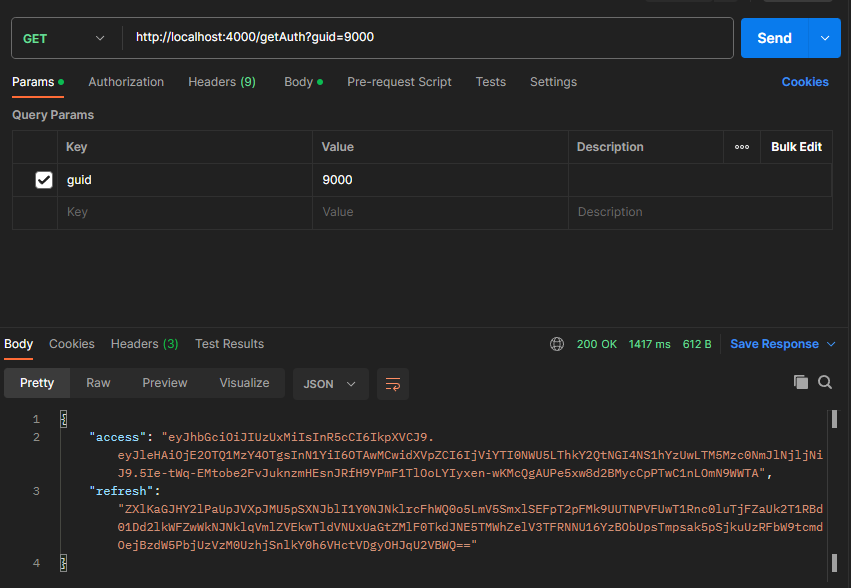
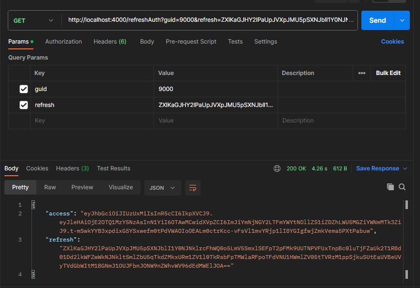

# auth-jwt

Используемые технологии:

- Go 
- JWT 
- MongoDB

Задание:

Написать часть сервиса аутентификации.

Два REST маршрута:
- Первый маршрут выдает пару Access, Refresh токенов для пользователя с идентификатором (GUID) указанным в параметре запроса
- Второй маршрут выполняет Refresh операцию на пару Access, Refresh токенов

Требования:

Access токен тип JWT, алгоритм SHA512, хранить в базе строго запрещено.

Refresh токен тип произвольный, формат передачи base64, хранится в базеисключительно в виде bcrypt хеша, должен быть защищен от изменения настороне клиента и попыток повторного использования.

Access, Refresh токены обоюдно связаны, Refresh операцию для Access токена можно выполнить только тем Refresh токеном который был выдан вместе с ним.

Первый маршрут выдает пару Access, Refresh токенов для пользователя с идентификатором (GUID) указанным в параметре запроса:

Второй маршрут выполняет Refresh операцию на пару Access, Refresh токенов:

