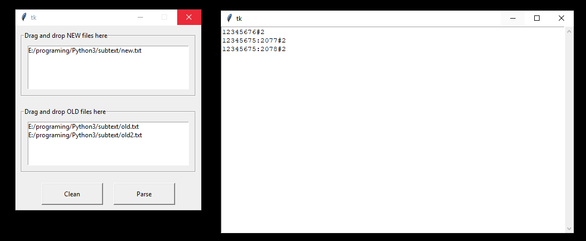

# GUI Substitute File Text
Simple Python GUI app for substitute strings from file. Filter selected by another file.

The result of parsing is the unique lines from the new files, which are not written in the old files. 

To run:
```
pip install tkinterdnd2
python subtextGUI.py
```

To distribute:
```
pip install PyInstaller
python -m PyInstaller --onefile --noconsole --collect-all tkinterdnd2 subtextGUI.py
```


