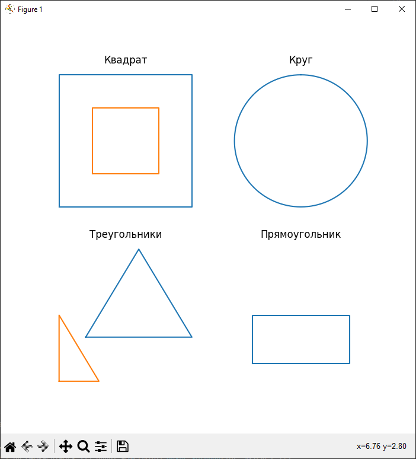

# Matplotlib-cpp-demo
### Отрисовка фигур с помощью [matplotlib-cpp](https://github.com/lava/matplotlib-cpp).

### Зависимости
- Python
- numpy

# Компиляция
### Windows
Для Python 3.11, установленного в C:\Python311.
```
g++ include/Objects/Object.cpp include/Objects/Circle.cpp include/Objects/Square.cpp include/Objects/Triangle.cpp include/Objects/Rectangle.cpp src/main.cpp -o build/output.exe -I c:\Python311\include -I include -I c:\Python311\Lib\site-packages\numpy\core\include\ -L c:\Python311\libs -lpython311
```

### Unix
```
g++ include/Objects/Object.cpp include/Objects/Circle.cpp include/Objects/Square.cpp include/Objects/Triangle.cpp include/Objects/Rectangle.cpp src/main.cpp -o build/output.a -I include -I/usr/include/python3.11 -lpython311
```

# Демо

